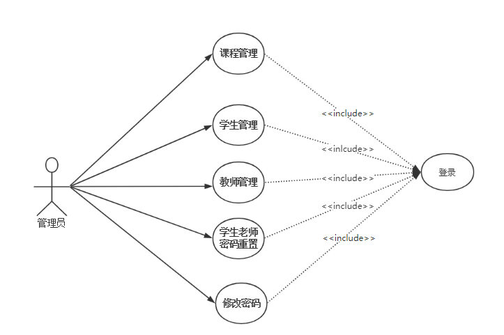
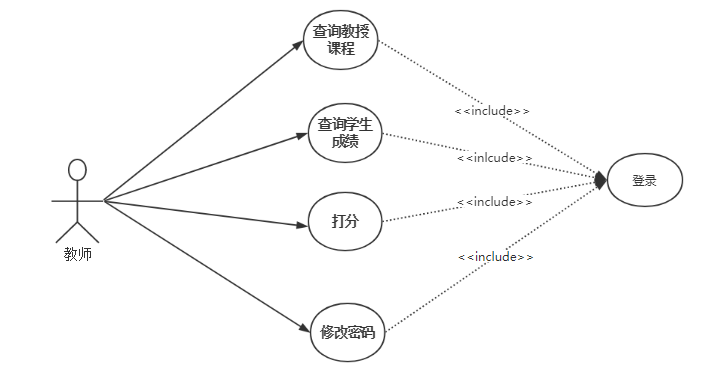
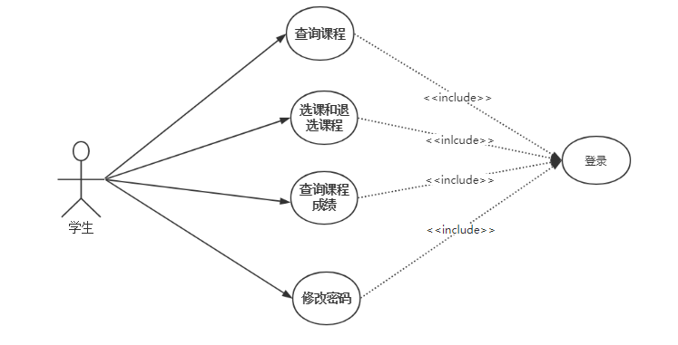
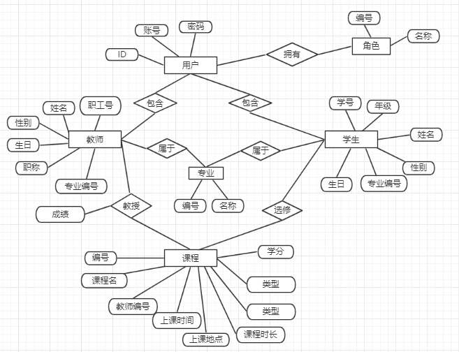

# 学校教务管理系统

## 项目组成员

- 武放放 邹世军 庹孟熙

## 项目技术

- spring+spring mvc+mybatis

## 运行环境

- jdk1.8+tomcat8+eclipse+mysql

## 项目描述

- 模拟学校的教务系统，运用Javaweb的SSM技术进行实现，系统分为三个角色，根据相应角色分配相应的权限

- 管理员

        课程管理：相应课程的增删改查
        学生管理：学生信息的增删改查
        教师管理：教师信息的增删改查
        账号密码重置：学生和老师的账号密码进行修改
        修改密码：修改管理员的密码

  

- 教师

        查询教授课程
        查询该课程下所有学生的成绩
        对学生的课程进行打分
        修改密码

  

- 学生

        查询课程
        选课和退选课程
        查询课程成绩
        修改密码

  

## 数据库E-R图

